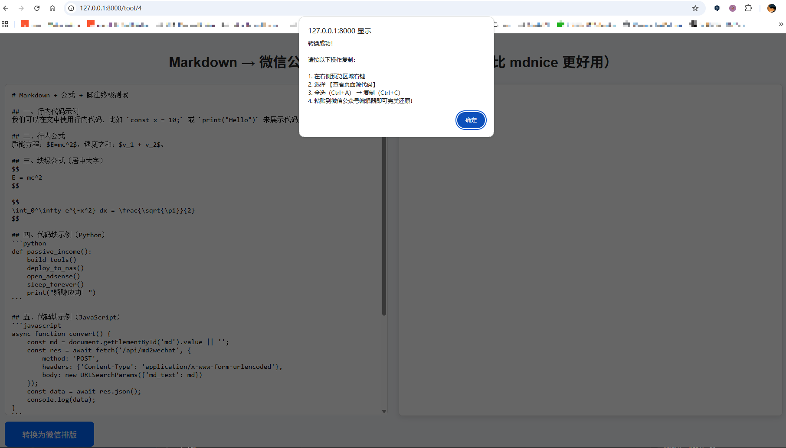
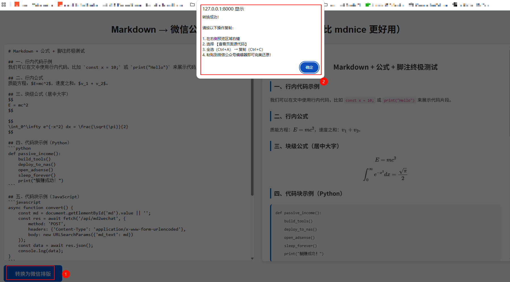
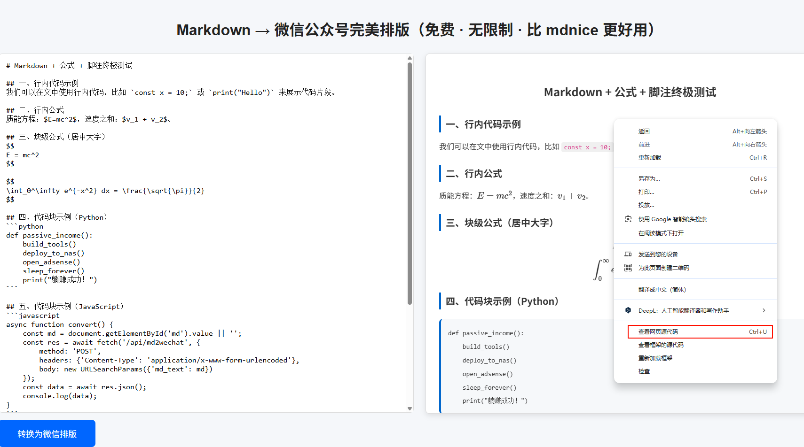
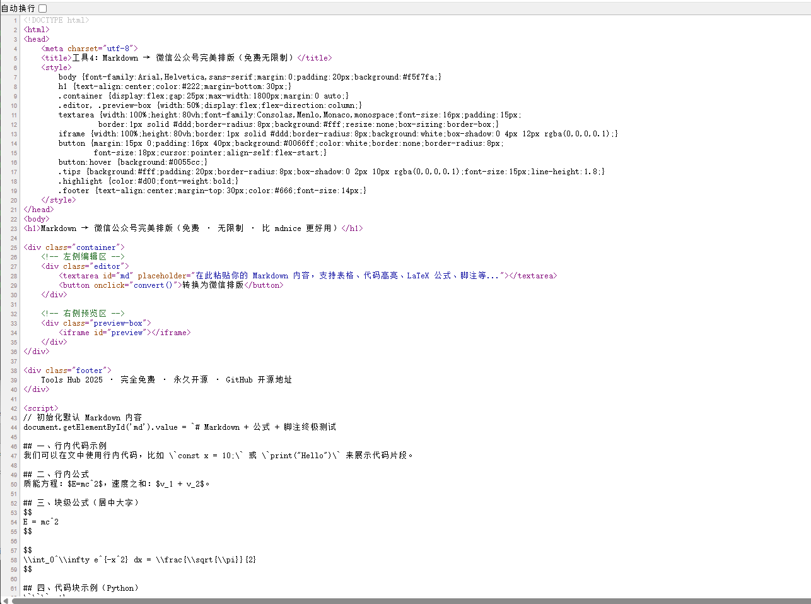

# 工具4：Markdown → 微信公众号完美排版（比 mdnice 好用100倍）

### 30秒上手教程（看图即可）

1. **输入 Markdown**  
   在左侧粘贴你的内容，支持公式、代码、表格、脚注  
   

2. **一键转换**  
   点击蓝色按钮 → 右侧自动预览  
   

3. **复制到公众号**  
   在右侧预览区域 → 右键 → 查看页面源代码 → 全选复制  
   

4. **粘贴即完美**  
   打开微信公众号编辑器 → 直接粘贴 → 100% 还原  
   

### 支持功能（全部100%还原）
- LaTeX 公式：`$E=mc^2$` → 完美渲染
- 代码高亮：```python``` → 微信原生高亮
- 表格、引用、脚注、图片链接
- 完全免费，无次数限制

**使用完别忘了 Star + 分享给你的程序员朋友**
